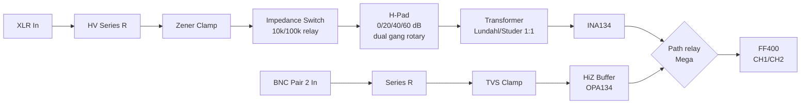
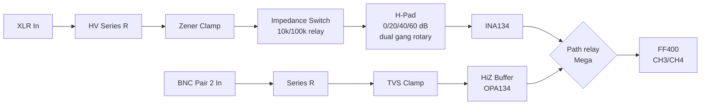
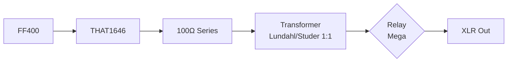
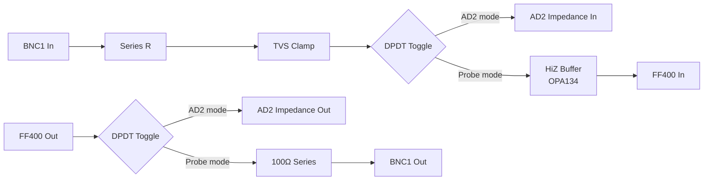
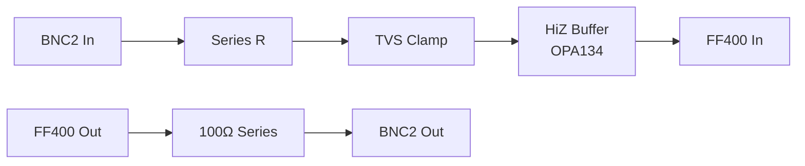
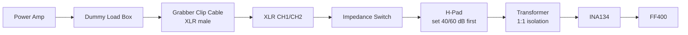

# Audio Measurement Frontend — Hardware Reference

## Project Overview

A professional audio measurement frontend housed in a **Bosch PA panel enclosure**, interfacing an **RME Fireface 400** and **Analog Discovery 2** with balanced XLR and BNC connections. Controlled by an **Arduino Mega 2560**, communicating with the `ac` measurement software over USB serial.

---

## System Architecture

### Input CH1/CH2 — Transformer Isolated

### Input CH3/CH4 — Direct

### Output CH1/CH2 — Transformer Isolated

### BNC Pair 1 — AD2 Impedance / Probe Switchable

### BNC Pair 2 — Probe Only

---

## Component Choices

### Analog Signal Path

| Stage | Component | Notes |
|---|---|---|
| Input differential receiver | INA134 | 0.0005% THD, fixed 1x gain |
| Output line driver | THAT1646 | 0.0003% THD, built-in short circuit protection |
| HiZ buffer | OPA134 | FET input, 1MΩ+ input impedance for probe use |
| Input transformers CH1/CH2 | Lundahl or Studer 1:1 | Part numbers TBC at office |
| Output transformers CH1/CH2 | Lundahl or Studer 1:1 | Part numbers TBC at office |

### Protection

| Location | Method |
|---|---|
| XLR inputs | HV series resistor + back-to-back zener clamp |
| BNC inputs | Series R + TVS clamp to ±24V |
| XLR outputs | 100Ω series + THAT1646 internal protection |
| BNC outputs | 100Ω series resistor |

---

## Pad Network

- **Topology:** Cumulative H-pad, balanced
- **Steps:** 3x 20 dB stages → 0 / 20 / 40 / 60 dB
- **Impedance:** 600Ω (transformer channels); TBC for direct channels
- **Stage 1 resistors:** 1W minimum rating (sees full input voltage)
- **Stages 2/3:** 0.25W sufficient
- **Maximum input:** ~77 Vrms (3 kW / 2Ω power amp), 109 V peak
- **Resistor values:** TBC pending transformer impedance confirmation

---

## Impedance Switching

- Options: 10 kΩ balanced / 100 kΩ balanced
- Control: Relay driven by Mega 2560
- Applies to all four input channels

---

## Control System

**Arduino Mega 2560** (DIN rail mounted, push terminals)

Handles:
- Impedance relay switching per channel (10 kΩ / 100 kΩ)
- Stereolink relay ganging (CH1+CH2, CH3+CH4)
- XLR / BNC path selection relays
- LED status indicators
- I2C to VFD display (optional, TBC)
- USB serial communication to `ac`

**Relay driver:** ULN2803 Darlington array for coil drive, flyback diodes on all relay coils.
**Relay coil voltage:** TBC pending inventory check.

### Serial Protocol — Mega → `ac`

Mega reports:
- Stereolink state per pair
- Active input path (XLR/BNC) per channel
- Impedance setting per channel
- Pad position per channel (read from rotary encoder or ADC)

`ac` uses this to:
- Apply correct calibration factors
- Configure measurement mode (stereo/mono)
- Adjust for active signal path

---

## Panel Layout

### Physical Controls

- 2x dual gang rotaries — pad selection (CH1/CH2 ganged, CH3/CH4 ganged)
- 1x DPDT toggle — BNC pair 1 mode (AD2 impedance / probe)
- Buttons via Mega — impedance selection, stereolink, path selection
- LEDs via Mega — status for all software-controlled states

### Connectors

- 4x XLR female — inputs CH1–CH4
- 2x XLR male — outputs CH1–CH2
- 4x BNC — 2x pair 1 (AD2/probe switchable), 2x pair 2 (probe only)
- Bosch panel existing cutouts — connector types TBC at office

---

## Measurement Workflows

| Mode | Path | Notes |
|---|---|---|
| Stereo balanced | XLR CH1/CH2 stereolinked | Transformer isolated, dual gang pad |
| Mono balanced | Single XLR channel | Stereolink disengaged |
| Power amp output | XLR grabber clip cable → CH1/CH2 | Set pad before connecting, transformer isolates |
| In-circuit probe | BNC pair 2, HiZ buffer | x1/x10 scope probe or grabber clips |
| AD2 impedance | BNC pair 1, DPDT to AD2 | |
| AD2 probe mode | BNC pair 1, DPDT to probe | |

### Power Amp Measurement Workflow

### Measurement Cables to Make

- 2x XLR male → grabber clips, 30 cm — stereo power amp
- 1x XLR male → grabber clips, 50 cm — general purpose
- Label all: **"HV MEAS — CHECK PAD BEFORE CONNECTING"**

---

## PCB Plan

### Boards

1. **Analog frontend board** — protection, impedance relays, H-pads, transformer interfaces, INA134, THAT1646, HiZ buffers
2. **Digital backend board** — Mega interface headers, relay drivers, ULN2803, I2C, power distribution
3. **PSU section** — ±15V analog rails, 5V logic, relay coil voltage (TBD)

### Design Notes

- KiCad schematic and layout
- Manufactured in China
- Mixed signal layout — careful ground plane separation between analog and digital sections

---

## Power Supply

| Rail | Purpose | Status |
|---|---|---|
| ±15V | Analog opamp supply | Design TBD |
| 5V | Logic, Mega | Standard |
| Coil voltage | Relay coils | TBC pending relay inventory |

External dummy load box is a **separate project**, not part of this frontend.

---

## Pending Items

Resolve before starting schematic:

- [ ] Lundahl transformer part numbers — check at office
- [ ] Studer transformer specs — check at office
- [ ] Transformer quantity — need 2x input, 2x output minimum; check at office
- [ ] Relay coil voltage — check relay bin at office
- [ ] Relay contact rating — check relay bin at office
- [ ] Bosch panel XLR/BNC connector types — measure/photograph at office
- [ ] Dual gang rotary sourcing — source once pad impedance confirmed

---

## Design Order (once pending items resolved)

1. H-pad resistor values (600Ω confirmed or revised)
2. Input protection network (series R, zener/TVS selection)
3. INA134 application circuit
4. HiZ buffer circuit (OPA134)
5. THAT1646 output stage
6. Relay circuits
7. Power supply section
8. Mega interface and firmware outline

---

## Related Projects

| Project | Description | Repo |
|---|---|---|
| `ac` | Python/JACK/ZMQ measurement software | mkovero/measuring |
| `usb2gpio` | USB to GPIO bridge for Mega 2560 | mkovero/usb2gpio |
| AD2 impedance board | Separate hardware, connects via BNC pair 1 | — |
| Dummy load box | Separate project, external to this frontend | — |
